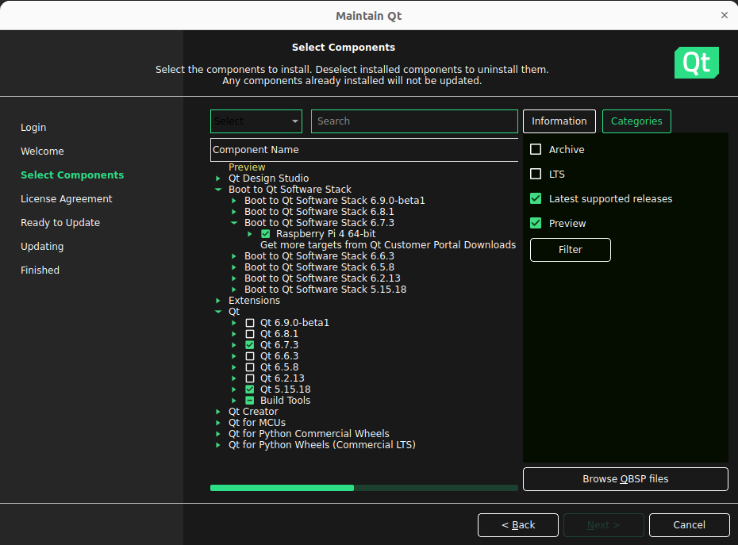
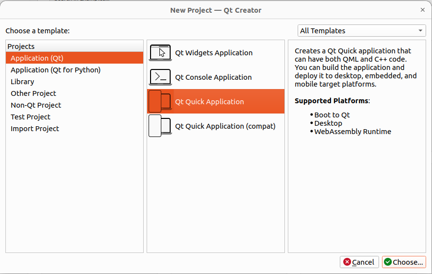
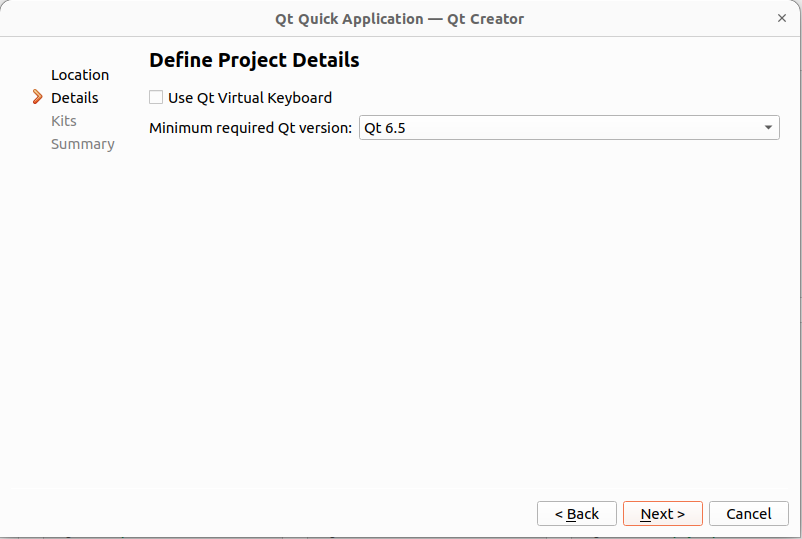
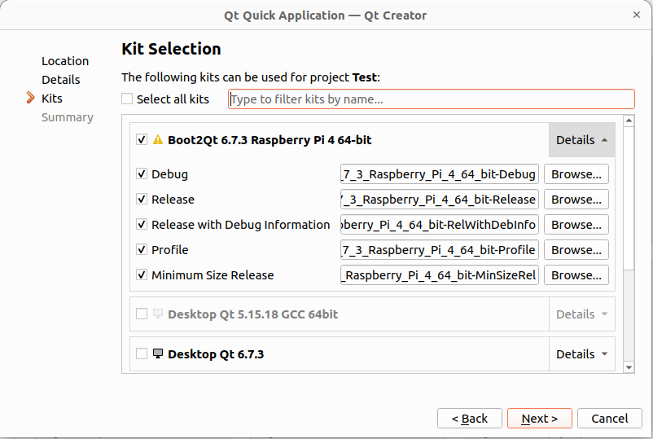

# Raspberry Pi custom build
This guide describes the steps to build custom linux build using [Buildroot](https://buildroot.org/)  for Raspberry Pi 4. The build focuses mainly on enabling Preempt-RT patch to run Linux in real-time, then Wi-Fi is enabled and using Qt6 to creating custom Qt applications.

## 1. Download buildroot

`cd ~`\
`git clone git://git.busybox.net/buildroot`

## 2. Get Linux kernel and patch
In order to enable Preempt-RT patch we have to match Linux kernel version and patch version. I find it easiest to download the desired kernel version from [here](https://www.kernel.org/pub/linux/kernel/) and then find its matching patch version [here](https://cdn.kernel.org/pub/linux/kernel/projects/rt/). These version should match as close as possible ideally the versions should be equal.
Download the patch in .patch.xz format.

Then write the hashes for patch and kernel.\
`cd buildroot`\
`vim linux/linux.hash`\
Find the corresponding hash for your patch file in sha256sums.asc, then find the corresponding hash for your kernel file in sha256sums.asc. Copy both lines to linux.hash. 

## 3. Enabling RT
Create a file `linux.config` in `buildroot/board/raspberrypi-rt`.

`mkdir board/raspberrypi-rt`\
`touch board/raspberrypi-rt/linux.config`

And pass in it the following:

    # enable full preemption 
    CONFIG_PREEMPT_RT=y

## 4. Create defconfig
Buildroot ships with basic minimal configs for lots of boards as well as Rapsberry Pi 4. These are located in `buildroot/configs`. Clone the `raspberrypi4_64_defconfig`

`cd configs`\
`cp raspberrypi4_64_defconfig custom_raspberrypi_4_64_defconfig`

Make changes to the following line:

    BR2_LINUX_KERNEL_CUSTOM_TARBALL_LOCATION="file:///home/petr/buildroot/linux-stable_20240529.tar.gz"

And change it so it points to the location of your kernel file like so:

    BR2_LINUX_KERNEL_CUSTOM_TARBALL_LOCATION="file://~/buildroot/linux-stable_20240529.tar.gz"

Then add the following lines to the file so that the link points to your patch file.

    BR2_LINUX_KERNEL_PATCH="https://cdn.kernel.org/pub/linux/kernel/projects/rt/6.6/older/patch-6.6.31-rt31.patch.xz"
    BR2_LINUX_KERNEL_CONFIG_FRAGMENT_FILES="board/raspberrypi-rt/linux.config"

Now make the defconfig.

`cd ..`\
`make custom_raspberrypi4_64_defconfig`

## 5. Enabling Wi-Fi

Now to enable Wi-Fi start the menuconfig.

`make menuconfig`

Enable mdev\
`System configuration -> /dev management -> Dynamic using devtmpfs + mdev`

Enable Rpi-firmware + Wi-Fi firmware\
`Target packages -> Hardware handling -> Firmware -> brcmfmac-sdio-firmware-rpi -> brcmfmac-sdio-firmware-rpi-wifi`\
`Target packages -> Hardware handling -> Firmware -> rpi-firmware -> rpi 4 (default)`

DHCP interface\
`System configuration -> Network interface to configure through DHCP -> wlan0`

Enable SSH\
`Target packages -> Networking applications -> openssh`

Enable DHCP\
`Target packages -> Networking applications -> dhcp (ISC) -> dhcp server -> Enable delayed ACK feature`\
`Target packages -> Networking applications -> dhcp (ISC) -> dhcp server -> Enable paranoia options`\
`Target packages -> Networking applications -> dhcp (ISC) -> dhcp relay`\
`Target packages -> Networking applications -> dhcp (ISC) -> dhcp client`\
`Target packages -> Networking applications -> dhcpd`\
`Target packages -> Networking applications -> dhcpdump`

Enable WPA_SUPPLICANT\
`Target packages -> Networking applications -> wpa_supplicant -> Enable nl80211 support`\
`Target packages -> Networking applications -> wpa_supplicant -> Enable autoscan`\
`Target packages -> Networking applications -> wpa_supplicant -> Enable WPS`\
`Target packages -> Networking applications -> wpa_supplicant -> Enable WPA3 support`\
`Target packages -> Networking applications -> wpa_supplicant -> Install wpa_cli binary`\
`Target packages -> Networking applications -> wpa_supplicant -> Install wpa_client shared library`\
`Target packages -> Networking applications -> wpa_supplicant -> Install wpa_passphrase binary`

Now Wi-Fi should be enabled.

## 6. Enabling Qt6
We will use Qt6 with direct framebuffer `linuxfb`

First enable fonts text will get displayed.\
`Target packages -> Fonts, cursors, icons, sounds and themes -> DejaVu fonts`

Then enable Qt6\
`Target packages -> Graphics libraries and applications -> Qt6 -> qt6base`\
`Target packages -> Graphics libraries and applications -> Qt6 -> qt6base -> gui module`\
`Target packages -> Graphics libraries and applications -> Qt6 -> qt6base -> gui module -> linuxfb support`\
`Target packages -> Graphics libraries and applications -> Qt6 -> qt6base -> gui module -> fontconfig support`\
`Target packages -> Graphics libraries and applications -> Qt6 -> qt6base -> gui module -> widgets module`\
`Target packages -> Graphics libraries and applications -> Qt6 -> qt6base -> gui module -> widgets module -> printing support`\
`Target packages -> Graphics libraries and applications -> Qt6 -> qt6base -> network module`\
`Target packages -> Graphics libraries and applications -> Qt6 -> qt6declarative`\
`Target packages -> Graphics libraries and applications -> Qt6 -> qt6declarative -> quick module`\
`Target packages -> Graphics libraries and applications -> Qt6 -> qt6svg`

Now Qt6 should be enabled.

## 7. Final modifications
Now everything should be ready. Before we make the build we should set the root password and enable vim or nano support in:\
`Target packages -> Text editors and viewers -> vim`

## 8. Build
Now save the config and proceed to build. This will take approximatelly 2-3 hours.\
`make`

After the build is finished write the image in `buildroot/output/image`
to your sdcard. You can use for example [balenaEtcher](https://etcher.balena.io/)

## 9. Screen resolution
If you have an HDMI display and need to set the resolution you can edit the file `config.txt` which is located in boot partion of the sdcard. I use [this display](https://biqu.equipment/products/bigtreetech-hdmi5-v1-0-hdmi7-v1-0?srsltid=AfmBOoqUnVOCdIJNJAyeoUxYi9mNu7-l6GgqVu6NE623K9qej1hkcWyk). The manufacturer states to include these lines in the file:
```
# uncomment to force a specific HDMI mode (this will force VGA)
hdmi_group=2
hdmi_mode=87
hdmi_cvt 800 480 60 6 0 0 0
# uncomment to force a HDMI mode rather than DVI. This can make audio work in
# DMT (computer monitor) modes
hdmi_drive=1
```

## 10. Booting and configuring Wi-Fi
Now boot the Raspberry Pi. After boot is finished log in as root.
To enable the Wi-Fi firstly configure the wpa_supplicant.conf file using the following command.\
`wpa_passphrase SSID pswd | tee /etc/wpa_supplicant.conf`

Then connect to Wi-Fi\
`wpa_supplicant -B -c /etc/wpa_supplicant.conf -i wlan0`\
The `-B` flag specifies to run the command in background.

Now we should be connected to Wi-Fi but we have yet to receive public IP address. Run\
`dhclient wlan0`

Now to check we are indeed connected run\
`ifconfig`

You should be able to see your IP address.

## 11. SSH root login
OpenSSH defaultly forbids root login over SSH. So we have to fix this.\
`vim /etc/ssh/sshd_config`\
Locate the lines `PasswordAuthentication yes` and ensure it is not commented and the option is set to `yes`.  Then locate `PermitRootLogin prohibit-password` and ensure it is not commented and change `prohibit-password`to `yes`.
Save the file and now we have to restart the sshd daemon.\
`killall sshd`\
`/usr/sbin/sshd`

Now we can test the SSH connection.

## 12. Qt developement
For developement it is easiest to use Qt Boot2Qt toolchain which can cross-compile from PC to Raspberry. Ensure you have the same version of Qt toolchain as your Qt on Raspberry. You can verify the version on your host machine
`buildroot/output/host/bin/qmake --version`

Then install Qt and Boot to Qt software Stack as follows


Now to develop your application run Qt Creator. Create a new project and 
select Qt Quick Application. 

Make sure the Minimal required version is less then the version that is located at Rapberry. 

Select a Boot2Qt Kit and create project.


Newer version of Qt6 use zstd for packaging. Since we do not have this package on Raspberry we can specify to not use this in CMakeLists.txt with the following command
`set(QT_FEATURE_zstd OFF)`

Then we can build our application and after building copy it to Raspberry over SSH using `scp`.

Since we want to use `linuxfb` we have to run the application on Raspberry like so
`./appTest -platform linuxfb`
